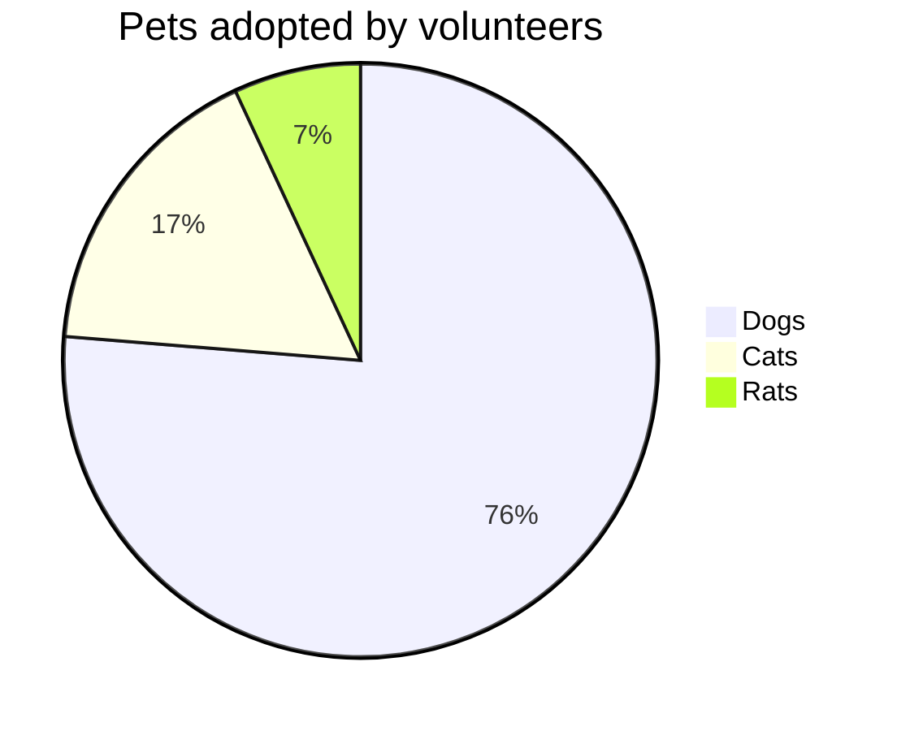
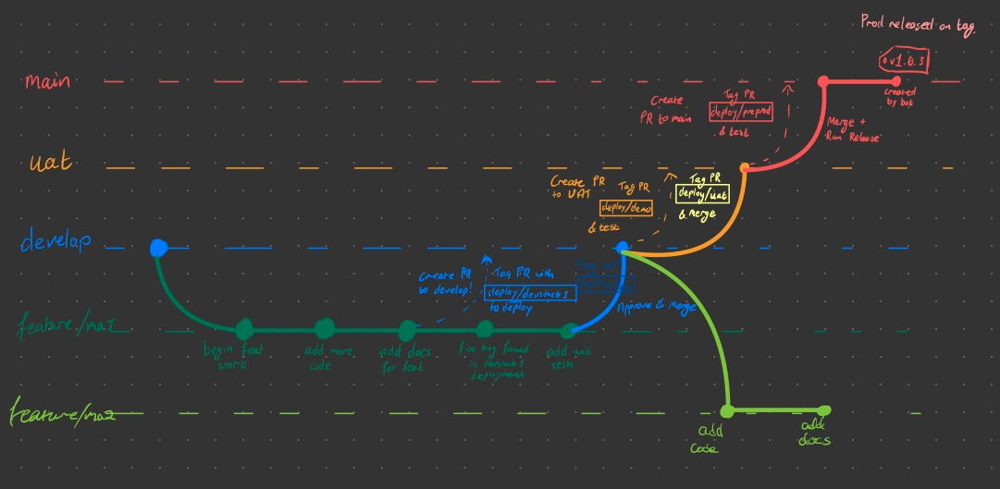

# This is the About Page

Hello

This is about me

```ts
const hi = "Hello Marinette.";

console.log(hi);
```


```mermaid
pie title Pets adopted by volunteers
  "Dogs" : 386
  "Cats" : 85
  "Rats" : 35
```


```mermaid!
pie title Pets adopted by volunteers
  "Dogs" : 386
  "Cats" : 85
  "Rats" : 35
```



[Index Link](./index.md)

Let's see if that works
